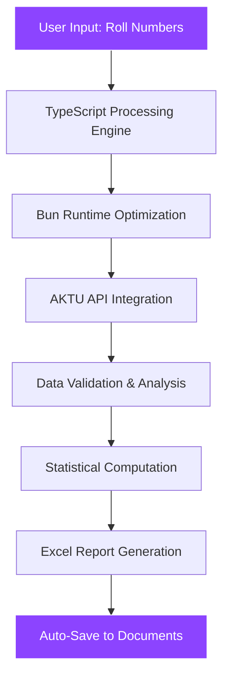

# 🌌 **SINGULARITY** 
### *The Future of AKTU Result Analysis*

<div align="center">

[](https://www.typescriptlang.org/)
[](https://nextjs.org/)
[](https://bun.sh/)
[](https://www.electronjs.org/)
[](https://tailwindcss.com/)

*A streamlined result extraction and analysis tool for AKTU-affiliated institutes*

[🚀 **Get Started**](#-getting-started) • [📊 **Features**](#-key-features) • [🎯 **Demo**](#-live-demo) • [📖 **Documentation**](#-documentation)

</div>

---

## 🌟 **Project Overview**

**Singularity** revolutionizes the way AKTU-affiliated institutions handle result processing. Built with cutting-edge technology, it transforms manual, error-prone workflows into a seamless, automated experience that delivers insights in seconds, not hours.

### 🎯 **Mission Statement**
> *To eliminate the inefficiencies of manual result analysis and empower educational institutions with lightning-fast, accurate, and comprehensive academic evaluation tools.*

---

## ✨ **Key Features**

<table>
  <tr>
    <td align="center">⚡</td>
    <td><strong>Lightning Processing</strong><br/>Process each roll number in ~2 seconds</td>
    <td align="center">🎯</td>
    <td><strong>95% Accuracy</strong><br/>Validated against MIET college records</td>
  </tr>
  <tr>
    <td align="center">📊</td>
    <td><strong>Comprehensive Analysis</strong><br/>SGPA, subject-wise performance, statistics</td>
    <td align="center">📈</td>
    <td><strong>Auto Excel Reports</strong><br/>Professional reports in Documents folder</td>
  </tr>
  <tr>
    <td align="center">🔧</td>
    <td><strong>AKTU Optimized</strong><br/>Built specifically for AKTU result formats</td>
    <td align="center">💻</td>
    <td><strong>Intuitive Interface</strong><br/>Designed for faculty and staff</td>
  </tr>
</table>

---

## 🏗️ **Architecture**



---

## 🚀 **Getting Started**

### **Prerequisites**
- Node.js 18+ or Bun runtime
- TypeScript 5+
- Modern web browser

### **Quick Start**

```bash
# Clone the repository
git clone https://github.com/your-username/singularity.git

# Navigate to project directory
cd singularity

# Install dependencies (using Bun for optimal performance)
bun install

# Start development server
bun run dev
```

### **Alternative Package Managers**
```bash
# Using npm
npm install && npm run dev

# Using yarn
yarn install && yarn dev

# Using pnpm
pnpm install && pnpm dev
```

> 🌐 **Access the application at:** [http://localhost:3000](http://localhost:3000)

---

## 🎯 **Live Demo**

### **Experience Singularity in Action**

<div align="center">

[](http://localhost:3000)

*Experience the future of result analysis*

</div>

---

## 🛠️ **Tech Stack**

<div align="center">

| Category | Technology | Purpose |
|----------|------------|---------|
| **Frontend** | Next.js 15 + React 19 | Modern UI framework |
| **Language** | TypeScript | Type-safe development |
| **Runtime** | Bun | High-performance execution |
| **Styling** | TailwindCSS | Utility-first CSS |
| **Animation** | Framer Motion | Smooth interactions |
| **Desktop** | Electron | Cross-platform app |
| **Data Processing** | Custom algorithms | Result extraction & analysis |

</div>

---

## 📊 **Project Timeline & Milestones**

```
📅 Project Duration: October 2024 - November 2025 (1 Year)

🎯 Key Milestones:
├── Phase 1: Core Development (Oct 2024 - Feb 2025)
├── Phase 2: MIET Validation (Mar 2025 - Apr 2025) ✅ 95% Accuracy
├── Phase 3: Market Research (May 2025 - Jun 2025)
├── Phase 4: Beta Testing (Jul 2025 - Sep 2025)
└── Phase 5: Production Release (Oct 2025 - Nov 2025)
```

---

## 👥 **Stakeholders & Impact**

<div align="center">

### **Primary Beneficiaries**

| Stakeholder | Benefit | Impact |
|-------------|---------|--------|
| 🎓 **Faculty Members** | Automated result processing | Save 80% of analysis time |
| 🏛️ **Registrar Offices** | Accurate reports generation | Eliminate manual errors |
| 👨‍💼 **HODs** | Comprehensive insights | Data-driven decisions |
| 🎯 **Students** | Faster result availability | Improved academic experience |

</div>

---

## 🔬 **Research & Development**

### **Knowledge Gaps Addressed**
- ❌ **Before:** Manual, time-intensive, error-prone result processing
- ✅ **After:** Fully automated, accurate, lightning-fast analysis

### **Innovation Highlights**
- 🚀 **First-of-its-kind** tool for AKTU format optimization
- ⚡ **2-second processing** per roll number
- 🎯 **95% accuracy** validation completed
- 💡 **Proprietary algorithms** for data extraction

---

## 📱 **Supported Platforms**

<div align="center">

| Platform | Status | Notes |
|----------|--------|-------|
| 🌐 **Web Application** | ✅ Active | Primary interface |
| 🖥️ **Windows Desktop** | 🔄 In Development | Electron-based |
| 🍎 **macOS Desktop** | 🔄 In Development | Electron-based |
| 🐧 **Linux Desktop** | 🔄 In Development | Electron-based |

</div>

---

## 🤝 **Contributing**

We welcome contributions from the AKTU community! 

### **Development Setup**
```bash
# Fork the repository
# Clone your fork
git clone https://github.com/your-username/singularity.git

# Create feature branch
git checkout -b feature/amazing-feature

# Make changes and commit
git commit -m "Add amazing feature"

# Push and create pull request
git push origin feature/amazing-feature
```

### **Code Standards**
- ✅ TypeScript strict mode
- ✅ ESLint + Prettier
- ✅ Comprehensive testing
- ✅ Clear documentation

---

## 📚 **Documentation**

<div align="center">

| Resource | Description | Link |
|----------|-------------|------|
| 📖 **User Guide** | Complete usage instructions | [View Guide](#) |
| 🔧 **API Documentation** | Technical implementation details | [View Docs](#) |
| 🎥 **Video Tutorials** | Step-by-step walkthroughs | [Watch Now](#) |
| 💬 **Community Forum** | Discussion and support | [Join Forum](#) |

</div>

---

## 🏆 **Project Leadership**

<div align="center">

### **Development Team**

| Role | Name | Expertise |
|------|------|-----------|
| 🎯 **Project Mentor** | Dr. Mukesh Rawat | Academic Leadership |
| 💻 **Lead Developer** | Development Team | TypeScript, Bun, Electron |
| 📊 **Data Analyst** | Analytics Team | Statistical Computing |
| 🎨 **UI/UX Designer** | Design Team | Modern Interface Design |

</div>

---

## 📄 **License & Legal**

### **Intellectual Property**
- 🛡️ **Proprietary Technology:** Patent-pending algorithms
- 🔒 **Data Security:** Full compliance with educational data privacy
- ⚖️ **Ethics:** No animal welfare or bio-safety concerns
- 🎓 **Academic Use:** Licensed for educational institutions

---

## 📞 **Support & Contact**

<div align="center">

### **Get Help & Stay Connected**

[](mailto:support@singularity.edu)
[](https://discord.gg/singularity)
[](https://github.com/singularity/issues)

**Institution Partnerships:** [partnerships@singularity.edu](mailto:partnerships@singularity.edu)

</div>

---

<div align="center">

### **🌟 Built for the Future of Education 🌟**

*Singularity - Where Technology Meets Academic Excellence*

[](https://github.com/singularity)
[](https://aktu.ac.in/)

**© 2024-2025 Singularity Project. Revolutionizing AKTU Result Analysis.**

</div>
